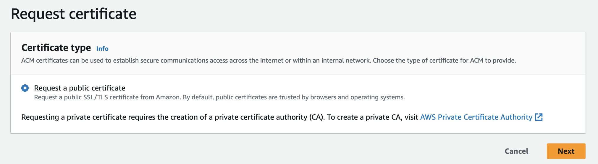

# 3-Tier-WebApp-Security-and-Connectivity
Understanding AWS Route 53 DNS Resolver, WAF Firewall, ACM, ALB, EC2 web servere

### AWS Route 53 - connects user requests to applications, resolves domain names, and returns IP addresses

Create a hosted zone for the domain - Create an alias record (the same region as your ALB) to Route traffic from the domain to an ALB

### AWS WAF protects your web application from common web exploits/attacks at the application layer (OSI Layer 7) as against NACLs/Security Groups which provide protection at the network/transport layer (OSI Layer 3/4). WAF also enables you to monitor incoming traffic metrics using CloudWatch

### WAF components: Access Control Lists (ACL), Rules and Rule Groups

### Web ACLs
Create a web access control list (ACL) by adding rules to protect your resources (including managed rules maintained by AWS)

### Rules 
Create rules to look for certain criteria and take action if the criteria are met (e.g., Allow request or Block request)
Each rule is assigned a WCU (Web ACL capacity unit), and all rules assigned to a particular Web ACL are capped at 1500 WCU

### Rules groups
Rules can be used individually or in reusable rule groups

### AWS ACM - Provisions, manages, and deploys public/private SSL/TLS Certificates
Request a public certificate

Add domain name from your Route 53 hosted zone and validate the domain by creating a CNAME record in Route 53 (this can be done automatically from ACM)

### AWS ALB - Distributes incoming traffic across multiple targets, such as EC2 instances.

### Create an application load balancer in a Public Subnet
On Configure Security Setting, choose the certificate you created from ACM - Edit the default HTTP listener to redirect HTTP traffic to HTTPS on ports 443 (All HTTP requests will be redirected as HTTPS secure traffic)

### Create a target group that should consist of the EC2 webservers, so the ALB can route traffic to them.
